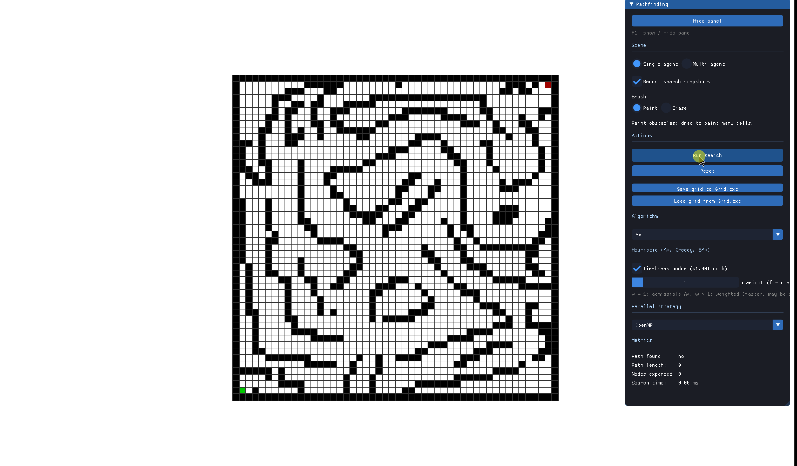

# Pathfinding

A 2D grid-based pathfinding visualizer built in C++ with SFML, demonstrating A*, Dijkstra, BFS, DFS, and Greedy Best-First Search in real time.

## Overview

Pathfinding is widely used in robotics, mapping applications, and video games. This project visualizes how pathfinding algorithms explore a grid to find the shortest path between two points, built to deepen my understanding of search algorithms. I also explored parallelizing the A* algorithm to handle multiple independent searches simultaneously — a common requirement in games with multi-agent systems like RTS titles.

## Features

- Interactive grid: click to set/remove start and end points, and place obstacles
- Real-time visualization of the search process (explored nodes, frontier, final path)
- Algorithms implemented: A*, Dijkstra, BFS, DFS, Greedy Best-First, and Bidirectional A*
- Interactive UI:
  - Displays metrics (path found, length, nodes expanded, search time)
  - Switch between single-agent and multi-agent simulation
  - Save/load grids to `Grid.txt`
  - A*-specific toggles: tie-breaking nudge on/off, and heuristic weight for Weighted A*
  - Dropdown to switch between algorithms
  - Dropdown to switch between parallelization strategies (sequential, `std::thread`, OpenMP)

## How it works

The grid is represented as a 2D array of `Cell` objects. Algorithms traverse horizontal and vertical neighbors only (no diagonal movement). Across most test cases, A* achieves the best search time and shortest path length.

## Built with

- C++
- SFML
- ImGui
- OpenMP

## Related writing

This project was accompanied by a term paper analyzing how to parallelize A* for multiple independent searches. [Read the full paper here](assets/Hoang%20Nguyen%20-%20Parallelizing%20A_%20Pathfinding%20on%20a%202D%20Grid%20for%20Game%20AI.pdf).